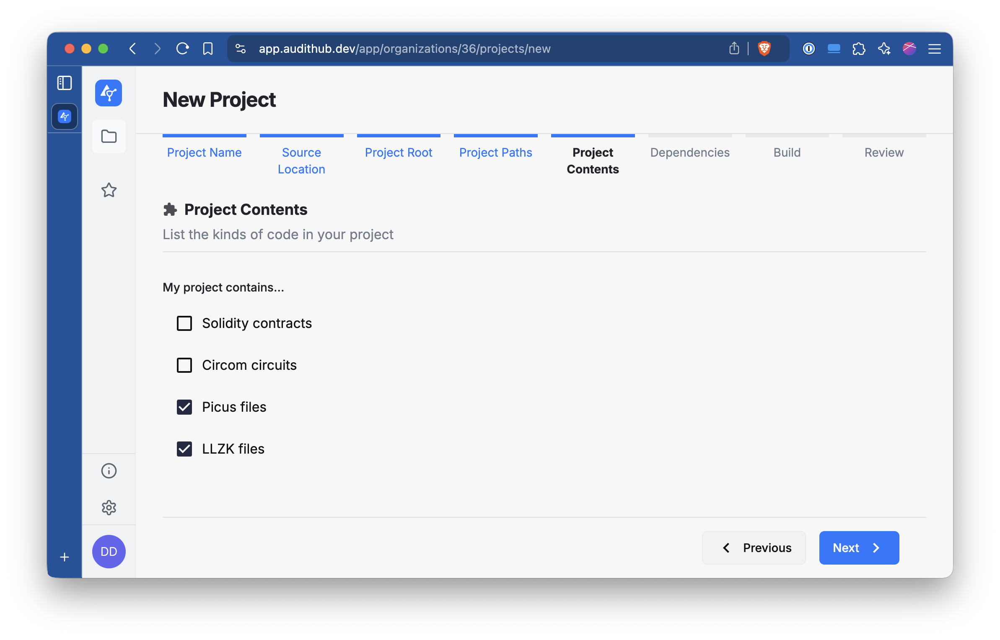
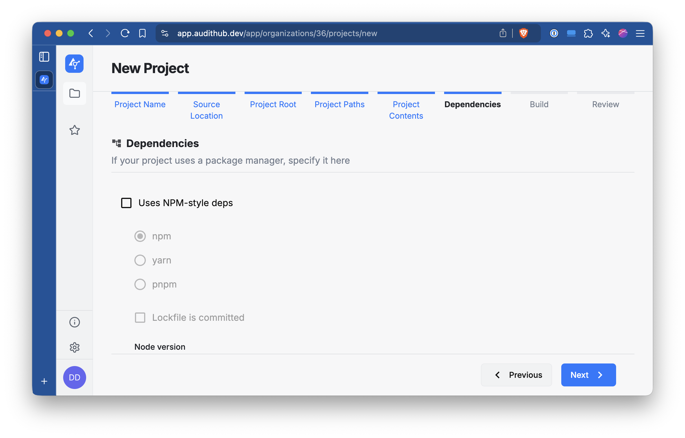
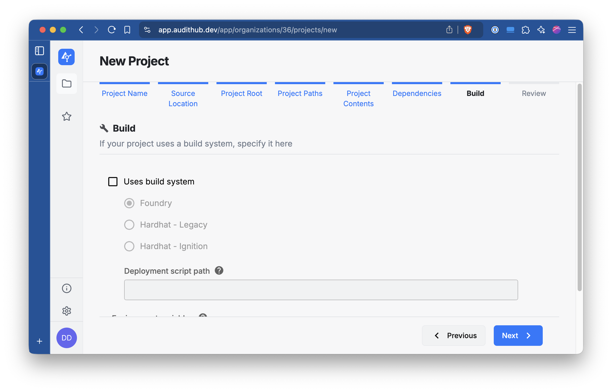
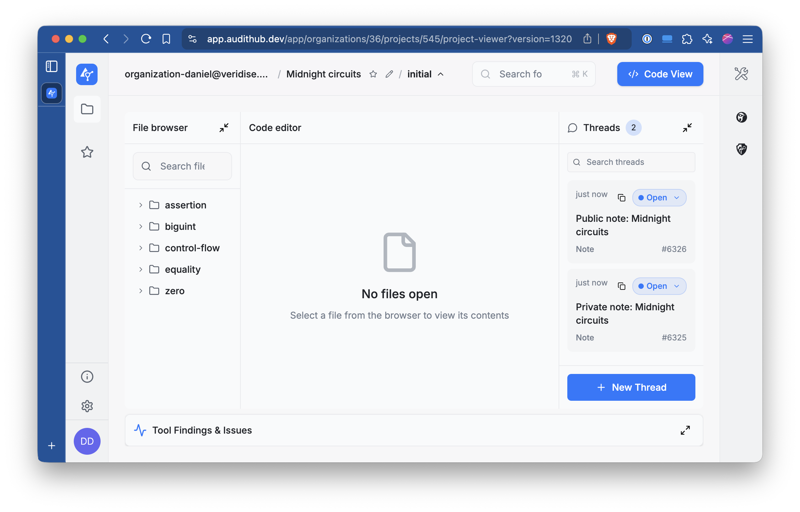

# Creating a new project

Before being able to upload new versions to AuditHub and launch jobs from the CLI it is necessary to create a project 
from the UI.
For the first version of the project generate _at least some_ Picus files with `midnight-extractor` and pack them into a ZIP file.

```bash
# For example, generate some Picus files for the equality instructions
midnight-extractor --chip native --type native equality
zip -r picus_files.zip picus_files
```

Then go to AuditHub's UI. Navigate to the organization where you want to create the project and click in Create New Project 


Give to the project a name and click Next.


Select the File option and locate the ZIP file we prepared earlier. Once you upload it click Next.


Select Archive root and click Next.


In this section, leave the options as they are and click Next.


Select Picus files (and optionally LLZK files) and click Next.



Leave the next two sections untouched and just click Next.





Check that everything looks right and click Submit.


Once the project has been created you will be able to access its main view. For interacting with this 
project from the CLI you need to pass the organization and project IDs. In the picture below, note the part 
`organizations/<number>/projects/<number>` of the URL. The first number is the organization ID (36) and the second the project ID (545).



These IDs can be configured as environment variables that the CLI will read.

```
export AUDITHUB_ORGANIZATION_ID=<organization id>
export AUDITHUB_PROJECT_ID=<project id>
```
