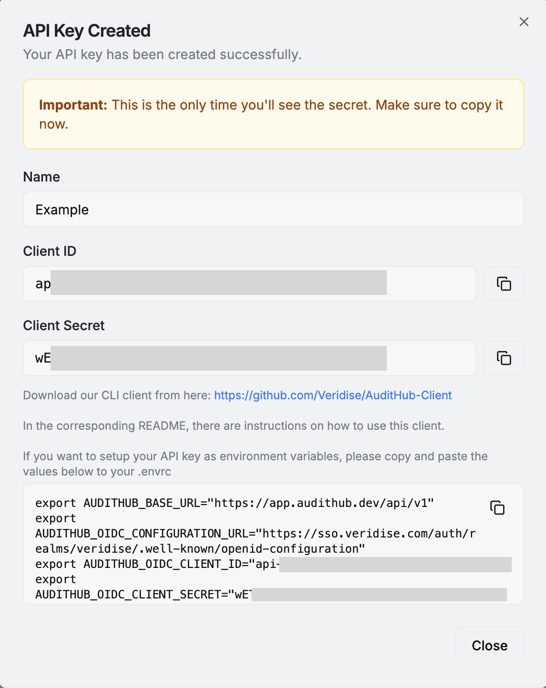

# AuditHub

AuditHub is a Veridise service where users can run verification tools such as Picus.
Is accesible via both its web interface and CLI. In this document we will explain 
how to prepare a project for AuditHub, how to configure the CLI, and how to use it for
interacting with AuditHub.

## AuditHub CLI 

The CLI is a Python 3 program that can be installed with pip (`pip install audithub-client`).

The CLI needs to be configured before using it. For that go to Account Settings / API Keys in 
AuditHub's UI. Store the given client id and client secret somewhere secure
depending on the intended usage of the keys. 



For using the keys locally it could be a `.envrc` file
managed by [direnv](https://direnv.net). For using them in CI that could be Github Secrets accesible 
by Github Actions. 

Once the keys are ready check the [CLI's documentation](https://pypi.org/project/audithub-client/) on how to 
configure you system such that the CLI can use them to connect to AuditHub.

You can confirm that the CLI is working correctly by running the following 

```
$ ah get-my-profile
{"id": "...", "name": "<Your name>", "email": "<Your email>", "rights": [...], ...}
```
